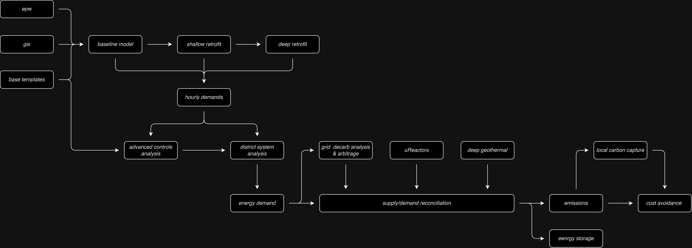

# MIT Campus Decarbonization
Materials for MIT Campus Decarbonization Study

## Setup

1. Install npm, conda (maybe docker)
2. npm i
3. npm run conda-setup
4. npx supabase init (?? maybe) && npx supabase login && npx supabase link
5. npm run db-refresh
